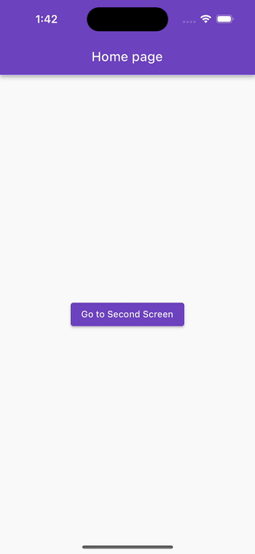

# Gestión de Estado en Flutter

La gestión de estado es un tema fundamental en el desarrollo de aplicaciones Flutter, con muchos paquetes y enfoques disponibles. Sin embargo, toda gestión de estado se basa en tres principios esenciales: representación del estado, almacenamiento y distribución (reactividad).

La representación del estado define cómo se estructuran los estados, el almacenamiento del estado se encarga de la gestión efectiva de estos estados, y la distribución del estado garantiza actualizaciones consistentes en toda la interfaz de usuario.

## Bloc no es solo bloc

Es común que los desarrolladores confundan los patrones de gestión de estado con las implementaciones de paquetes. El patrón Bloc es un ejemplo destacado de esta confusión, con algunos desarrolladores creyendo que una aplicación solo sigue el patrón Bloc si utiliza el paquete bloc.

## Bloc con ValueNotifier

Cuando gestiono el estado de una aplicación, prefiero utilizar el patrón Bloc y seguir las convenciones de nomenclatura establecidas, como se describe en [convenciones de nomenclatura de bloc](https://bloclibrary.dev/#/blocnamingconventions). Sin embargo, priorizo el uso de ValueNotifier, ya que es una solución de gestión de estado incorporada en Flutter. También implemento una versión modificada de Cubit utilizando ValueNotifier y estoy dispuesto a hacer la transición al paquete bloc si es necesario.

No obstante, el paquete bloc ofrece herramientas valiosas que deseo utilizar con ValueNotifier. Para las pantallas que tienen estados de datos y estados de acciones, como carga o mensajes de error, herramientas como [`BlocListener`](https://pub.dev/documentation/flutter_bloc/latest/flutter_bloc/BlocListener-class.html) y [BlocConsumer](https://pub.dev/documentation/flutter_bloc/latest/flutter_bloc/BlocConsumer-class.html) son útiles. Me permiten controlar qué estado se ejecuta en el constructor y realizar otras acciones necesarias en la pantalla.

En este proyecto, creé la clase [`ValueNotifierConsumer`](lib/shared/value_notifier/value_notifier_consumer.dart), inspirada en `BlocConsumer` de bloc. En el ejemplo del proyecto, utilicé la propiedad `buildWhen` para gestionar la activación del `constructor`.

El `constructor` en este caso es responsable de presentar el resultado de `state.success`.

Los estados de acciones (carga y error) deben superponerse en los datos, y `listenWhen` determina cuándo se activa el `escuchador`.

```dart
@override
  Widget build(BuildContext context) {
    return Scaffold(
      appBar: AppBar(
        title: const Text('Second page'),
        actions: [_ReloadAction(controller: controller)],
      ),
      body: ValueNotifierConsumer<AppState>(
        valueListenable: controller,
        listenWhen: _isListenableState,
        listener: _executeListener,
        buildWhen: _isBuildableState,
        builder: (BuildContext context, AppState state, Widget? child) {
          LoadingWidget.instance().hide();

          return state.maybeMap(
            success: (v) => _ShowItemsListWidget(items: v.elements),
            orElse: () => Container(color: Colors.black26),
          );
        },
      ),
    );
  }
```


