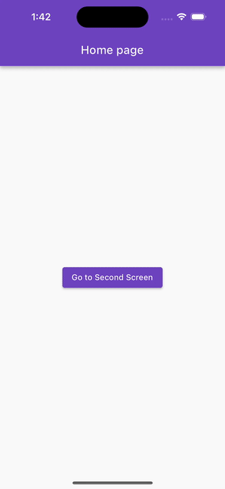

# Gerenciamento de Estado no Flutter

O gerenciamento de estado é um tópico fundamental no desenvolvimento de aplicativos Flutter, com uma ampla gama de pacotes e abordagens disponíveis.

No entanto todo gerenciamento de estado está baseado em três princípios essenciais: representação do estado, armazenamento do estado e distribuição do estado (reatividade).

A representação do estado envolve definir como os estados são estruturados, o armazenamento lida com a gestão eficaz desses estados, e a distribuição do estado garante que as mudanças nos dados sejam refletidas uniformemente em toda a interface do usuário.

## Bloc não é bloc

Não é incomum os desenvolvedores confundiram padrão de gestão de estado com a implementação num pacote. O padrão Bloc é um excelente exemplo desta confusão, onde muito desenvolvedores acreditam que uma aplicação só utiliza o padrão Bloc se estiver utilizando o pacote bloc.

## Bloc com ValueNotifier

Preferencialmente utilizo Bloc no gerenciamento de estado nas aplicações, utilizando-se dos padrões bem documentado [convenção de nomenclatura](https://bloclibrary.dev/#/blocnamingconventions), mas priorizando a implementação com ValueNotifier por ser uma gestão nativa do Flutter. Basicamente implemento uma versão do Cubit em ValueNotifier e se necessário migrar para o bloc no futuro.

Mas a implementação do pacote bloc traz algumas ferramentas que me faz falta no ValueNotifier. Quando estamos lidando com tela onde temos `state` de dados e `state` de ações (**loading**, **error message**), ferramentas como o [`BlocListener`](https://pub.dev/documentation/flutter_bloc/latest/flutter_bloc/BlocListener-class.html) e [BlocConsumer](https://pub.dev/documentation/flutter_bloc/latest/flutter_bloc/BlocConsumer-class.html) contribui muito no controle de qual `state` que será executado no builder ou terá outro tipo de ação na tela.

Neste projeto criei o [`ValueNotifierConsumer`](lib/shared/value_notifier/value_notifier_consumer.dart) inspirado no `BlocConsumer` do bloc.

No exemplo neste projeto, estou utilizando a propriedade `buildWhen` para controlar quando o `builder` será controlado. 

O `builder` neste caso é responsável para apresentar o resultado do `state.success`.

Os `states` de ação (`loading` e `error`) deverá ser apresentado como um overlay sobre os dados, e para isto é utilizado o `listenWhen` para validar quando executar o `listener`.

```dart
@override
  Widget build(BuildContext context) {
    return Scaffold(
      appBar: AppBar(
        title: const Text('Second page'),
        actions: [_ReloadAction(controller: controller)],
      ),
      body: ValueNotifierConsumer<AppState>(
        valueListenable: controller,
        listenWhen: _isListenableState,
        listener: _executeListener,
        buildWhen: _isBuildableState,
        builder: (BuildContext context, AppState state, Widget? child) {
          LoadingWidget.instance().hide();

          return state.maybeMap(
            success: (v) => _ShowItemsListWidget(items: v.elements),
            orElse: () => Container(color: Colors.black26),
          );
        },
      ),
    );
  }
```


